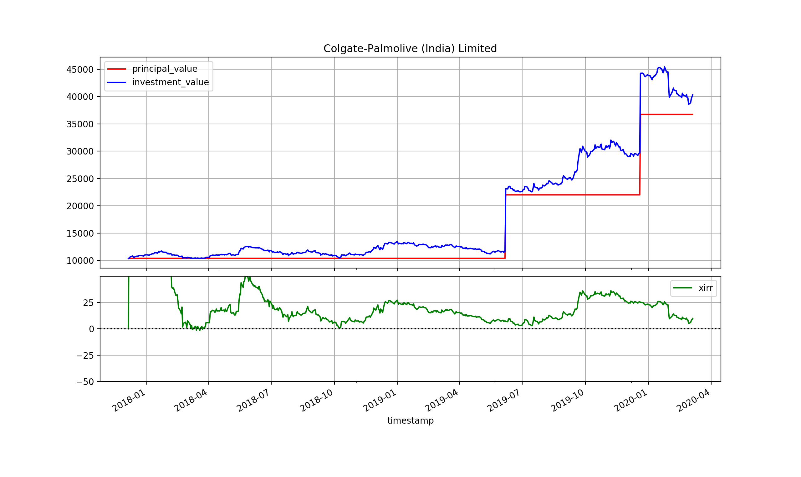

# Print historical stock returns and XIRR in Python

## Description

This Python script enables you to print the historical stock returns 
and XIRR. For e.g. if you bought Colgate-Palmolive (India) Limited 
listed on NSE with below details.

| Purchase date | Price per share | Quantity |
|---|---|---|
|2017-12-05|1038.22|10|
|2019-06-07|1161.27|10|
|2019-12-20|1474.28|10|

The script will generate chart as below.



The script was built and tested using Python 3.8.1 and uses
historical stock data downloaded from 
[Alpha Vantage](https://www.alphavantage.co/) to calculate returns
and generate chart.

## How to use the script?

1. Install Python 3.8 from https://www.python.org/.
2. The script uses historical stock data downloaded from 
[Alpha Vantage](https://www.alphavantage.co/) to calculate returns 
and generate charts. To access the service you need an API KEY.
Register  yourself for free on https://www.alphavantage.co/ to get 
API KEY.
3. This step is optional but I would recommend it if you are new
to Python (like I was when I created this script). Download PyCharm
Community Edition from https://www.jetbrains.com/pycharm/. It will
help you to setup the script, install all dependencies and run it.
4. Update the file `download_stock_data.py` with the stock symbol
that you own. For e.g. `SYMBOL_LIST = ["NSE:COLPAL", "NSE:HDFCBANK"]`
Run the file `download_stock_data.py`. It will ask for API KEY. 
Enter the key that you generated from step #2. It will download the
historical stock data in CSV format.
5. Update the file `stock_data.py` with the buy details for your stock.
For e.g.
    ```python
    STOCK_DATA = {
        "Colgate-Palmolive (India) Limited": [
            {
                "symbol": "NSE:COLPAL", # Symbol for that stock you bought
                "date": "2017-12-05",   # Date of purchase in YYYY-MM-DD format
                "price": 1038.22,       # Price per share
                "quantity": 10          # Quantity of shares bought
            },
            {
                "symbol": "NSE:COLPAL",
                "date": "2019-06-07",
                "price": 1161.27,
                "quantity": 10
            },
            {
                "symbol": "NSE:COLPAL",
                "date": "2019-12-20",
                "price": 1474.28,
                "quantity": 10
            }
        ]
    }
    ```
6. In `print_stock_returns.py` update the stock name in variable 
`GENERATE_CHART_FOR` For e.g. `GENERATE_CHART_FOR:str = "Colgate-Palmolive (India) Limited"`.
Run `print_stock_returns.py` to generate chart.

### Add multiple stock details

Run `print_stock_returns.py` with 
1. `GENERATE_CHART_FOR:str = "Colgate-Palmolive (India) Limited"`
2. `GENERATE_CHART_FOR:str = "Havells India"`

```python
STOCK_DATA = {
    "Colgate-Palmolive (India) Limited": [
        {
            "symbol": "NSE:COLPAL",  # Symbol for that stock you bought
            "date": "2017-12-05",  # Date of purchase in YYYY-MM-DD format
            "price": 1038.22,  # Price per share
            "quantity": 10  # Quantity of shares bought
        },
        {
            "symbol": "NSE:COLPAL",
            "date": "2019-06-07",
            "price": 1161.27,
            "quantity": 10
        },
        {
            "symbol": "NSE:COLPAL",
            "date": "2019-12-20",
            "price": 1474.28,
            "quantity": 10
        }
    ],
    "Havells India": [
        {
            "symbol": "NSE:HAVELLS",
            "date": "2018-09-11",
            "price": 640,
            "quantity": 10
        },
        {
            "symbol": "NSE:HAVELLS",
            "date": "2019-04-05",
            "price": 760,
            "quantity": 15
        },
        {
            "symbol": "NSE:HAVELLS",
            "date": "2019-09-04",
            "price": 650,
            "quantity": 15
        }
    ]
}
```

### Add bonus stock details

Add bonus stock details by setting price per share as zero.

```python
STOCK_DATA = {
    "ICICI Bank": [
        {
            "symbol": "NSE:ICICIBANK",
            "date": "2016-02-16",
            "price": 200,
            "quantity": 2
        },
        {
            "symbol": "NSE:ICICIBANK",
            "date": "2016-06-21",
            "price": 245,
            "quantity": 40
        },
        {
            "symbol": "NSE:ICICIBANK",
            "date": "2017-06-28",
            "price": 0, # Set zero as price per share for bonus share received
            "quantity": 4
        }
    ]
}
```

### Add share details received as part of demerger

For e.g. Greenply Industries demerged MDF business with 
Greenpanel Industries. You can mention the details as below.

```python
STOCK_DATA = {
    "Greenply Industries": [
        {
            "symbol": "NSE:GREENPLY",
            "date": "2017-04-05",
            "price": 285,
            "quantity": 18
        },
        {
            "symbol": "NSE:GREENPLY",
            "date": "2018-10-01",
            "price": 210,
            "quantity": 23
        },
        {
            "symbol": "NSE:GREENPANEL", # Symbol of demerged entity
            "date": "2019-10-24", # Date of shares credited to demat account
            "price": 0, # Set price as zero as it was received 
            "quantity": 41
        }
    ]
}
```

## Limitations

1. The script cannot handle stock spilt. You will have to calculate
the price per share post split and update `stock_data.py`.
2. For some companies, data previous to particular date is not available.
For e.g. IDFC First Bank was IDFC Bank previous to its merger with
Capital First Bank. Historical share price of IDFC Bank does not 
seem to available on Alpha Vantage.

